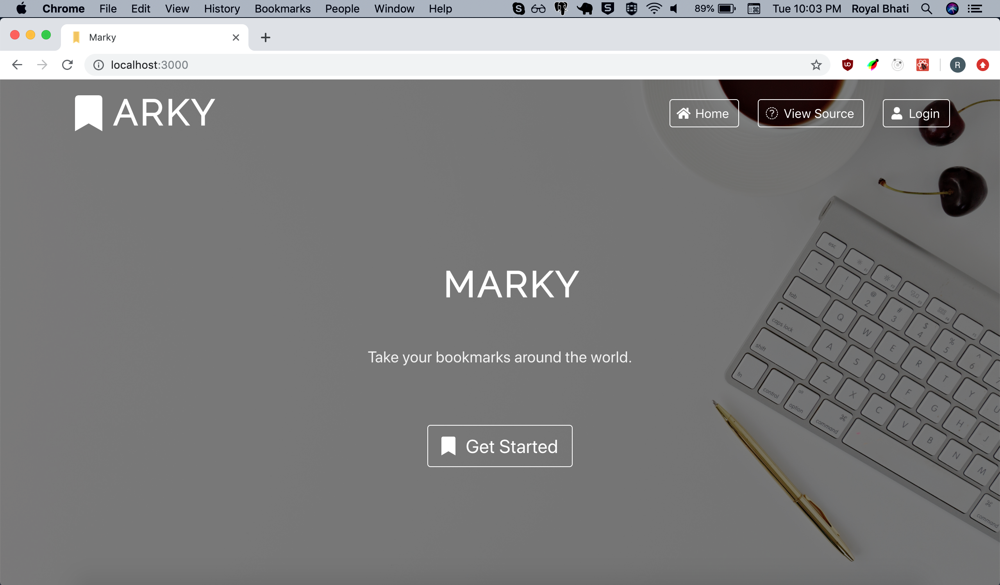
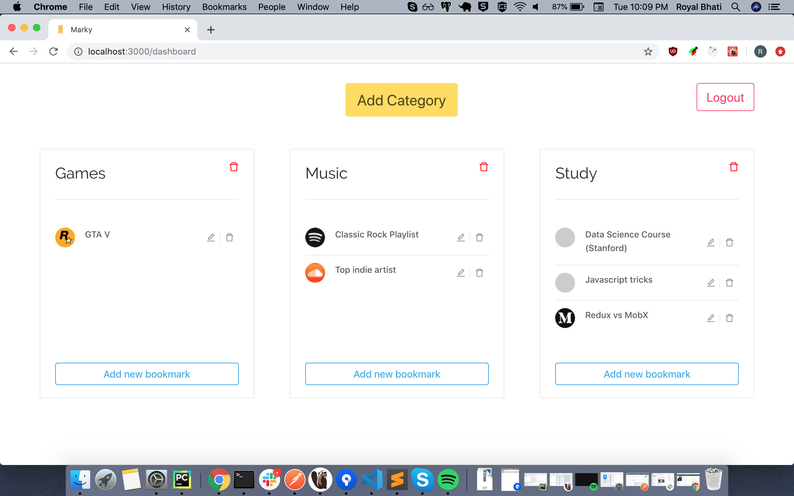
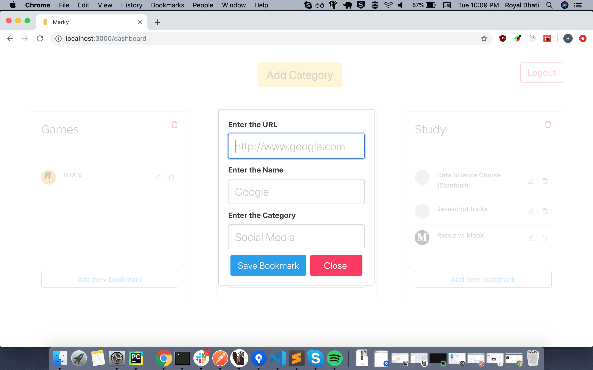

## BookMark manager :bookmark: ( using MERN stack)

Store your favorite bookmarks online. Available everywhere.

## DEMO (hosted on heroku)

[Marky]()

## Available Scripts

In the project directory,there are two folders:

1. Client :

Containing the frontend

    USe `npm start`

    Runs the app in the development mode. 
    Open [http://localhost:3000](http://localhost:3000) to view it in the browser.

    The page will reload if you make edits. 
    You will also see any lint errors in the console.

1. Server :

Containing the backend

    USe `npm start` to run the backend server

## Screenshots

## ToDO

### Implement auth middleware for backend

### Write test cases

### Use styled components

### Make it more optimised
